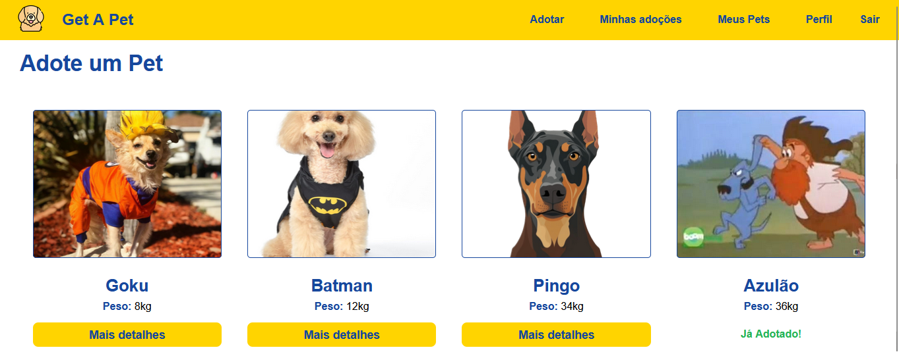

# Sistema de Adoção de Pets

 <!-- Substitua "capa.png" pelo caminho correto da imagem de capa -->

## Sobre o Projeto

Este é um sistema completo para gerenciar a adoção de pets, desenvolvido como um projeto full stack. Ele foi construído com foco em facilitar a interação entre adotantes e doadores, permitindo o cadastro, gerenciamento e adoção de pets de forma prática e segura.

## Funcionalidades

### Back-end
- **Autenticação:** Sistema de login e logout com geração de tokens JWT.
- **Gerenciamento de Usuários:** Cadastro, alteração de dados pessoais e upload de imagem de perfil.
- **Gestão de Pets:** Cadastro, atualização e exclusão de informações dos pets, incluindo upload de múltiplas imagens.
- **Adoção:** Sistema para agendamento de visitas e confirmação de adoções.

### Front-end
- **Dashboard:** Interface para cadastro e gerenciamento de pets.
- **Lista de Pets Disponíveis:** Exibição dos pets cadastrados para adoção.
- **Agendamento de Visitas:** Funcionalidade para que os usuários interessados possam agendar visitas.
- **Confirmação de Adoção:** Possibilidade de o doador confirmar quando a adoção for concluída.

## Tecnologias Utilizadas

### Back-end
- **Node.js**
- **Express**
- **Mongoose**
- **JSON Web Token (JWT)**
- **Bcrypt**
- **Arquitetura MVC**

### Front-end
- **React.js**

### Banco de Dados
- **MongoDB**

## Como Executar o Projeto

### Pré-requisitos
Certifique-se de ter os seguintes programas instalados:
- [Node.js](https://nodejs.org/)
- [MongoDB](https://www.mongodb.com/)

### Configuração do Back-end
1. Clone o repositório:
   ```bash
   git clone https://github.com/seu-usuario/sistema-adocao-pets.git
   cd sistema-adocao-pets/backend
   ```

2. Instale as dependências:
   ```bash
   npm install
   ```

3. Configure as variáveis de ambiente no arquivo `.env`:
   ```env
   PORT=3017
   MONGO_URI=sua-string-de-conexao-mongodb
   JWT_SECRET=sua-chave-secreta
   ```

4. Inicie o servidor:
   ```bash
   npm start
   ```

### Configuração do Front-end
1. Navegue até a pasta do front-end:
   ```bash
   cd ../frontend
   ```

2. Instale as dependências:
   ```bash
   npm install
   ```

3. Inicie o servidor de desenvolvimento:
   ```bash
   npm start
   ```

4. Acesse o sistema no navegador em [http://localhost:3000](http://localhost:3000).

## Estrutura de Diretórios

```
/
├── backend
│   ├── controllers
│   ├── db
│   ├── helpers
│   ├── models
│   ├── routes
│   └── server.js
├── frontend
│   ├── src
│   │   ├── components
│   │   ├── context
│   │   ├── hooks
│   │   ├── utils
│   │   ├── App.js
│   │   └── index.js
└── README.md
```

## Licença

Este projeto está sob a licença MIT. Veja o arquivo [LICENSE](./LICENSE) para mais informações.

## Contato

- **Nome:** Gustavo Matos
- **Email:** matos.gustavo@outlook.com
- **GitHub:** [GitHub](https://github.com/gustavonascimentomatos)
